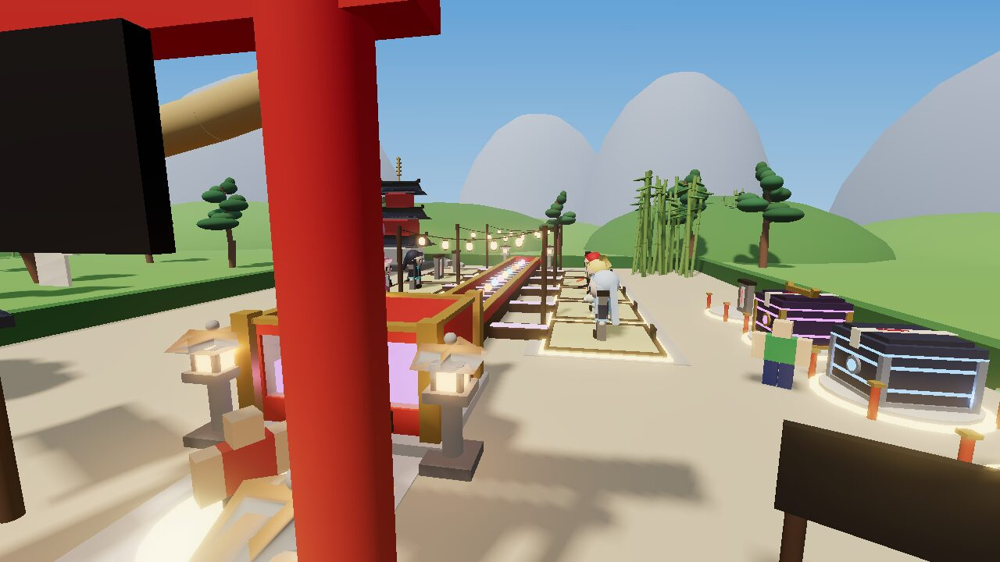
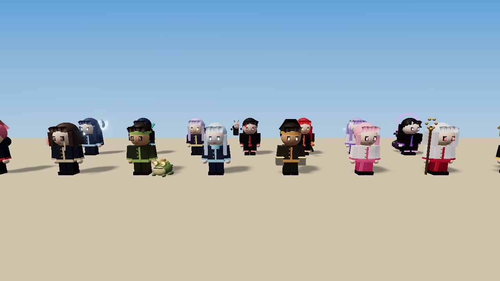
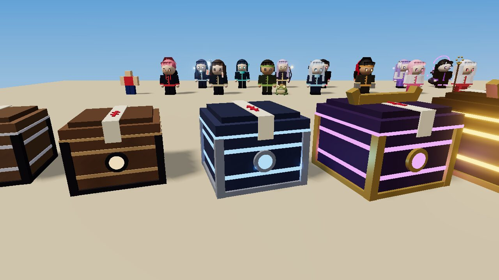
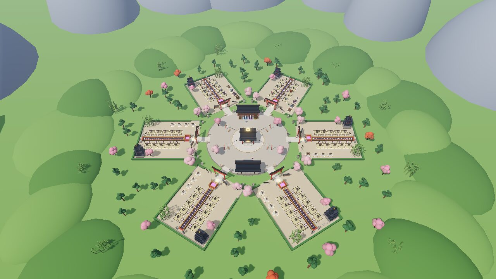
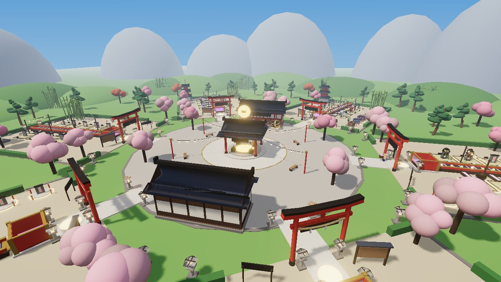
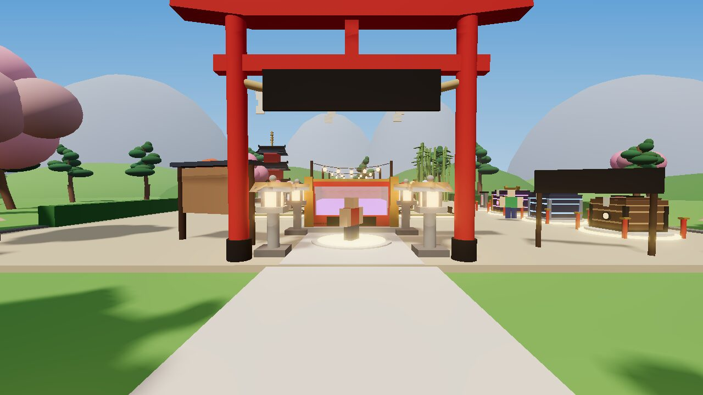
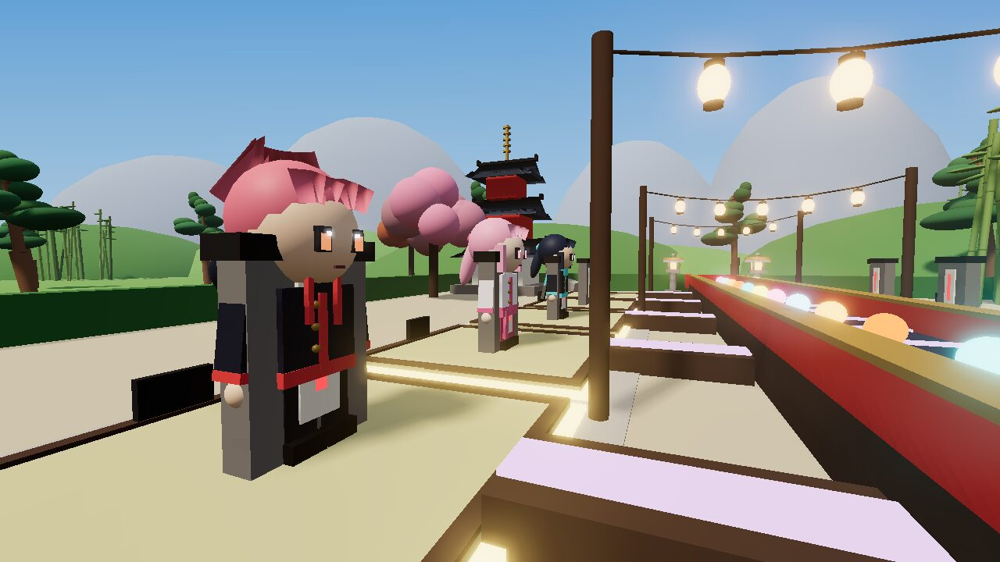
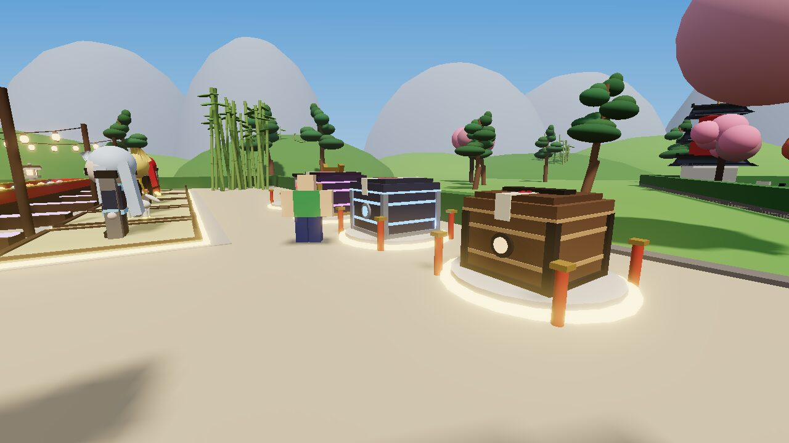
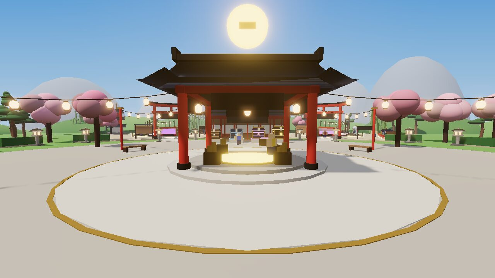
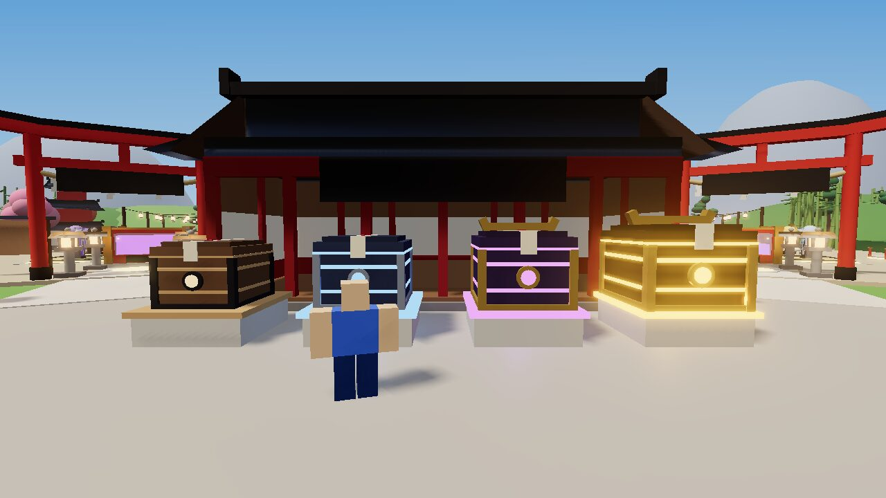

# JJK Farm

A Roblox character-production farm with a Jujutsu Kaisen-inspired theme, built around the
farming loop of [Blue Lock Farm](https://www.roblox.com/games/132767904294856/Blue-Lock-Farm):
open Crates to get Sorcerers, place them on Your Farm, watch them make Cursed Orbs that roll
down a lane into your Orb Box, collect the box, sell it for Cash, and reinvest.

All names, characters, designs and techniques are original. There are no anime assets,
Toolbox models or third-party code. Every model is built from Roblox primitives by the
scripts in this repo.



> **Current state (after the October 2 Studio audit):** the defects the audit confirmed are
> fixed (see *Audit fixes*). The orb conveyor is rejected, and the part-built characters and
> props are being replaced with Marketplace avatar items and Toolbox models. That work is
> planned in [`docs/NEXT_STEPS_PROPOSAL.md`](docs/NEXT_STEPS_PROPOSAL.md) and waits on a few
> decisions plus network access to Roblox's catalog. Until then the visuals in this build
> are the old prototype ones.

> **Studio status: I had no Roblox Studio connection.** This was built in a cloud container
> without Studio, so **no checks ran in Roblox Studio**. The handoff is the place file
> **[`dist/JJKFarm.rbxl`](dist/JJKFarm.rbxl)**, which contains the whole map, lighting and every
> script. Everything was verified offline instead (see *Verification*). The images here are
> three.js renders of the baked geometry, not Roblox screenshots. UI text and particles
> aren't drawn in them.

---

## Play it in Studio

1. Open **`dist/JJKFarm.rbxl`** in Roblox Studio (double-click it, or File > Open).
2. Press **Play**. You spawn at Your Farm. A card at the top of the screen walks you through
   the loop, and a glowing beam points to each next stop.

Saving in Studio: publish the place, then turn on **Game Settings > Security > Enable Studio
Access to API Services**. Without it the game runs on a temporary in-memory store and says so
in a toast. It never writes fake data.

Before publishing for real players:

- **Set Max Players to 6** (Creator Dashboard > your experience > Places > Server Size).
  Each server has six farms. A seventh player can walk around but gets a toast that every
  farm is taken.
- Optional: add music and ambient audio IDs (see *Sound*).

## The loop

| # | Step | Where | What you do |
|---|---|---|---|
| 1 | Get a Crate | Start | New players get a free **Starter Crate**. |
| 2 | **Place** it, wait, **Open** | Your Farm's **Crate Pads** (front-left) | Press **Place** at an empty pad. A timer above the crate counts down its **Opening Time**, which keeps running while you're offline. When it says READY, press **Open**. |
| 3 | Reveal | On the pad | The crate shakes harder and harder, glows in the colour of what's inside, then the lid bursts off in a pillar of light. A card shows the **Sorcerer**, its rarity, technique, **Orb Value** and **Orbs per Second**. |
| 4 | **Place** the Sorcerer | A production slot | Press **Place** on the card (or at an empty slot). A translucent preview shows where it goes. |
| 5 | Production | The slot and the lane | Each Sorcerer performs its technique (Punch, Slash, Cast or Shoot) and makes a **Cursed Orb** in its technique's colour. The orb arcs over the slot's chute into the **collection lane**, rides the moving lane and drops into the **Orb Box**. The glowing pile inside the box rises and turns gold when the box is full. A full box stops production until you collect it. |
| 6 | **Collect** | The **Collect Pad** in front of the Orb Box | Step on the pad or press **Collect**. Your character carries a glowing box labelled with the orb count. |
| 7 | **Sell** | The **Sell Stand** in the middle of the plaza | Step on the gold pad or press **Sell**. Coins burst out and the Cash lands on your counter. |
| 8 | Reinvest | **Crate Shop** (north), **Upgrade Shop** (south), Sorcerers menu | **Buy** better crates, **Upgrade** Sorcerers (more Orb Value per level), and buy farm upgrades: Orb Value, More Slots (3 -> 10), Box Size, Opening Speed, More Crate Pads (2 -> 4), Luck and Walk Speed. |

Production is visible at all times. The HUD shows Cash, Cash per second, Orbs per Second and
the Orb Box fill, but the lane, the box and the carried orbs show the same numbers in the
world. Each farm also has a stats board, and the box has a live counter over it.

### Names used everywhere

Game **JJK Farm**, currency **Cash**, containers **Crates**, characters **Sorcerers**,
products **Cursed Orbs**, collection containers **Orb Boxes**, player area **Your Farm**,
shops **Crate Shop** and **Upgrade Shop**. Buttons and prompts use **Buy, Open, Place,
Pick Up, Collect, Sell, Upgrade**. Stats are **Orb Value, Orbs per Second, Opening Time**.
Rarities are **Common, Uncommon, Rare, Epic, Legendary**. The same words appear in the UI,
world signs, prompts, the tutorial and notifications. (The only extra prompt word is
"Browse", which opens the Crate Shop catalogue.)

### Controls

| | Keyboard / mouse | Touch | Gamepad |
|---|---|---|---|
| Buy / Open / Place / Collect / Sell / Upgrade | **E** at the prompt | Tap the prompt | X |
| Pick Up (Sorcerer or Crate) | **R** at the prompt | Tap the prompt | Y |
| Placement | Hover a glowing slot or pad and click it | Tap a target, then **Place** | D-pad, then A |
| Sorcerers / Crates / Crate Shop / Upgrade Shop / Home | G / C / B / U / H | Right-side buttons | |

You can also just walk: the Collect Pad collects and the Sell Stand sells when you step on them.

## Sorcerers and Crates

15 original Sorcerers, three per rarity. Each has its own model, colours, technique and
technique animation, and some bring a companion spirit (toad, wolf, moth, mask or serpent).
They stand 1.35 times avatar height on the farm so you can read them from the path.

| Rarity | Sorcerers (technique) | Orb Value at Lv 1 | Max level |
|---|---|---|---|
| Common | Kai (Spark Palm), Mina (Paper Seal), Toru (Toad Call) | $2-3 | 10 |
| Uncommon | Rei (Ice Needle), Goro (Stone Fist), Hana (Petal Storm) | $5-8 | 15 |
| Rare | Suzu (Bell Strike), Daiki (Thunder Kick), Nao (Moth Lantern) | $16-22 | 20 |
| Epic | Ryo (Tide Slash), Emi (Star Arrow), Juzo (Mask Curse) | $55-90 | 25 |
| Legendary | Akane (Crimson Blade), Shion (Moon Mirror), Yoru (Void Palm) | $200-260 | 30 |

| Crate | Price | Opening Time | Odds (before Luck) |
|---|---|---|---|
| Starter Crate | free, once | 10 s | always Kai |
| Basic Crate | $60 | 30 s | Common 75%, Uncommon 22%, Rare 3% |
| Rare Crate | $2,000 | 2 min | Common 20%, Uncommon 50%, Rare 27%, Epic 3% |
| Epic Crate | $75,000 | 5 min | Uncommon 25%, Rare 50%, Epic 24%, Legendary 1% |
| Legendary Crate | $2,500,000 | 10 min | Rare 35%, Epic 55%, Legendary 10% |




**Pacing.** `tools/lune/simulate.luau` has a greedy bot play the real rules, including a
walk to the Sell Stand for every sale. Its last run: tutorial finished at 1 min, 4 slots at
5 min, first Epic at 22 min, 8 slots at 36 min, first Legendary at 71 min, all 10 slots at
92 min. Real players will be slower than the bot. Balance lives in `src/shared/Config/`.

## The map



A compact central plaza is ringed by six identical farms, each facing the plaza through its
own torii gate. Every interaction is a short walk: about 6 seconds from a farm's Orb Box to
the Sell Stand at default walk speed.

- **Plaza**: the **Sell Stand** pavilion in the middle (a spinning gold coin marks it from
  every farm), the **Crate Shop** to the north with the four crates on display (walk up and
  press **Buy**), and the **Upgrade Shop** to the south with its upgrade board. Paved paths
  with stone lanterns lead to each farm gate.
- **Your Farm** (100 x 120 studs): the entrance torii with the owner's name (you see "Your
  Farm"), the Collect Pad and Orb Box straight ahead, four **Crate Pads** on the front-left,
  ten production slots in two rows either side of the raised **collection lane**, a stats
  board, and a pagoda, bamboo and sakura at the back for the skyline. Low hedges keep
  sightlines clear across the whole farm.
- **Scale**: built around a 5-stud avatar. Gates are 23 studs tall, shops have 13-stud walls,
  slots are 12 x 12, crates are about avatar height, the Orb Box is 12 x 7 x 10.
- **Lighting**: a clear early-afternoon sun (ClockTime 14.6), light haze, soft shadows and
  gentle bloom so the neon orbs still glow. Future lighting.
- No terrain: the ground, hills and mountains are parts, so the place looks the same in
  Studio edit mode as in play.

| | |
|---|---|
|  |  |
|  |  |
|  |  |

The previews include a staged mid-game farm and blocky 5.2-stud avatar stand-ins for scale.
In the game, Sorcerers, crates and orbs are added by the server and client at runtime.

## Saving, offline progress and safety

**Saved per player**: Cash, every Sorcerer and its level, which slot each one stands on, farm
upgrades, every Crate (including which pad it's on and the **absolute time it finishes
opening**, or the time left if you picked it up), the Orb Box contents and the time they were
last settled, the orbs you're carrying, tutorial progress, settings and stats.

**Offline progress** is calculated **once per absence**, when your profile loads:

- Your Sorcerers' production since the box was last saved is added to the Orb Box. It is
  capped at **8 hours** (`GameConfig.MaxOfflineSeconds`) **and** at the box's capacity,
  so a bigger Box Size upgrade means more to come back to.
- Crates keep opening because their finish time is stored, not a countdown.
- The welcome-back toast reports the time away, the orbs made and the crates that finished.

**Duplicate-claim protection**: the claim moves the Orb Box's timestamp to the load time,
and that timestamp is what gets saved. A second join can only count time after it. Profiles
are **session-locked** (UpdateAsync with a lock and job id), so two servers can't load the
same profile at once. If a server dies before saving, the old timestamp is still in the
store and nothing was paid out, so nothing is lost or doubled. Box timestamps from the future
(clock skew) are clamped to now. The integration test leaves, rejoins after an hour, collects,
then leaves and rejoins immediately, and checks that no second payout happens.

**Server authority**: Cash, purchases, crate rolls, placements, production and sales are all
computed on the server by pure rule functions (`src/shared/Rules/Actions.luau`). Clients only
send requests. Every request is type-checked (integers, id formats, known crate and upgrade
ids), rate-limited (8/s with a burst of 16, plus a separate limiter for the touch pads) and
position-checked: you must be on Your Farm to place, pick up or open, within 22 studs of your
Orb Box to Collect, at the Sell Stand to Sell, and at the right shop to Buy or Upgrade.
Failed loads never fall back to a blank profile: the player is told to rejoin and the stored
data is untouched. There is no paid monetization.

## Reference research: what I could and couldn't check

- I could **not** open the Roblox page or any wiki. Direct fetches of roblox.com and the fan
  wikis were blocked by this environment's network proxy. **I didn't watch any gameplay
  footage.** I can't access video here, so the physical layout of the original isn't copied
  from footage.
- What I could read were search-engine summaries of fan guides. Those describe the loop as:
  buy lockers to get players, place them so they farm balls, collect and **sell full crates
  for Cash**, keep earning while offline, and reinvest in better lockers and upgrades that
  boost crate value, luck, opening speed, movement and base size. Sources:
  [Blue Lock Farm Beginner Guide](https://blue-lock-farm-wiki.wiki/guides/beginner-guide),
  [How to Open Lockers](https://blue-lock-farm-wiki.wiki/lockers/how-to-open-lockers),
  [How to Get Money Fast](https://blue-lock-farm-wiki.wiki/earnings/money-guide),
  [Blue Lock Farm Guide: Open Lockers to Earn Cash](https://bluelockfarm.buzz/),
  [Blue Lock Farm Wiki](https://bluelockfarm.com/wiki/).
- Mapped onto this game: lockers became **Crates** with an **Opening Time**, players became
  **Sorcerers**, balls became **Cursed Orbs**, ball crates became the **Orb Box**. The
  upgrades follow the same categories: Box Size, Luck, Opening Speed, Walk Speed, and More
  Slots/Crate Pads for base size. Specific numbers, the lane, the farm layout and the plaza
  are my own design, not taken from the original.

## Project layout

```
default.project.json         Rojo project (Shared -> ReplicatedStorage, Server -> ServerScriptService,
                             Client -> StarterPlayerScripts; Future lighting; walk speed 20)
src/shared/Config/           GameConfig, Sorcerers, Crates, Rarities, Upgrades, FarmLayout, SoundConfig
src/shared/Rules/            Economy (formulas), Actions (authoritative actions), ProfileSchema
                             (shape, sanitizing, migration), Tutorial
src/shared/Visuals/          CharacterModels (Sorcerers + companions), CrateModels, PartKit
src/server/Services/         DataService (+ Data/ProfileStore, MockDataStore), StateService,
                             FarmService (farms, models, carried box, spawning), GameService
                             (requests, validation, touch pads), MapService
src/server/Map/              MapBuilder, Plaza, Farm, Scenery, Kit (architecture/nature pieces),
                             Palette, Atmosphere
src/client/Controllers/      State, UI (HUD), World (prompts, labels), Production (techniques,
                             orbs, lane, box fill), Effects, Reveal, Placement, Tutorial, Sound,
                             Notification
src/client/UI/               UIKit, Theme, Panels/ (Sorcerers, Crates, CrateShop, UpgradeShop, Settings)
tests/                       rules.spec (economy, crates, box, offline, upgrades, tutorial), data.spec
tools/lune/                  bake, test, integration, client_smoke, simulate, models + lib/ (sandbox,
                             engine shim, preview staging)
tools/preview/               three.js renderer for offline previews
dist/JJKFarm.rbxl            the built place: map, lighting and all scripts
```

## Building from source

Tools (pinned in `rokit.toml`): Rojo 7.5.1, Lune 0.10.4, StyLua 2.1.0, luau-lsp 1.53.1 and
Selene 0.29.0. Install them with [rokit](https://github.com/rojo-rbx/rokit) (`rokit install`).

```bash
scripts/build.sh                                      # build + bake + all tests
LUAU_DEFS=path/to/globalTypes.d.luau scripts/build.sh # also run type analysis
PREVIEW=1 scripts/build.sh                            # also render previews (needs Node)
```

To live-sync code while editing in Studio: open `dist/JJKFarm.rbxl`, run `rojo serve`, and
connect with the Rojo plugin. The baked map and lighting stay, because the project doesn't own
those Workspace and Lighting children. `rojo build default.project.json` alone gives a
code-only place, and the server builds the map at startup.

### Sound

Sounds are defined in `src/shared/Config/SoundConfig.luau`. The defaults use audio that ships
with the Roblox client (`rbxasset://sounds/...`), so they load without uploads or permissions,
but there are only a few of them. Put Creator Store audio IDs in the `id` fields to improve
them. Music is silent until you add an ID.

## Audit fixes (October 2)

| Audit finding | Fix |
|---|---|
| Navigation buttons off screen (1558 x 753 viewport) | The full-screen HUD container is no longer scaled. The stats column, right-hand menu and toasts each scale around their own screen-edge anchor, and the scale is capped so the menu fits top to bottom and beside the stats column. Sizes come from the ScreenGui's own size, so the top-bar inset and safe areas are excluded. Panels that can't fit at a readable scale (minimum 0.62) scroll instead of shrinking. |
| A second server could take a live save lock after 12 s | The lock is now a lease. It is only taken over once it hasn't been renewed for 300 s, never "after N retries". A loading server asks the holder (via MessagingService) to save and release, then retries. The owning server refuses changes 60 s before its lease could lapse if saves keep failing, and retries the save every 15 s. |
| Malformed saved data became a fresh profile | Stored data is validated before use. Wrong types where tables or numbers belong, or a newer data version, are refused: the player is asked to rejoin, nothing is written, and corrupt records get a `meta.quarantine` note for recovery. Defaults are only created when the store has no record at all. |
| Moving a finished crate restarted its timer | `remaining = 0` is kept through Pick Up, save and Place, so a finished crate stays finished. |
| Unknown crate tiers deleted on load | Unknown or malformed crates (and sorcerers) are preserved in `orphanCrates` / `orphanUnits` and restored when the tier exists again. `Crates.Aliases` migrates renamed tiers. |
| Touch pads skipped range checks | Collect and Sell are range- and alive-checked on every path, prompts and touch pads alike. |
| Placement mixed screen coordinate spaces | Hover uses `GetMouseLocation` with `ViewportPointToRay`. Clicks and taps use `InputObject.Position` with `ScreenPointToRay`. |
| Tutorial could point at an impossible action after a detour | `Tutorial.guidance` reads the farm's actual state (crate picked up, no Sorcerer placed, nothing carried, not enough Cash) and gives a doable instruction and target. Unit-tested. |

Not fixed here, by design: the visible-versus-credited production mismatch and the offline
capacity problem both belong to the orb system being replaced. The replacement's single
production schedule and its storage targets are in the proposal. Audio still needs
Creator Store IDs. A multi-device performance pass needs Studio and real devices.

## Verification

**Checks run in Roblox Studio by me: none.** I have no Studio connection. Your October 2
audit is the only Studio testing so far. These checks ran offline in this environment,
against the same scripts and the same baked place file:

| Check | Result |
|---|---|
| `luau-lsp analyze` with Roblox type definitions over all of `src/` | 0 errors |
| Unit tests (economy, crates and odds, Orb Box, collect/sell, offline cap and once-only claim, upgrades, tutorial and detour guidance, profile validation and repair, lease locking with two servers including the audit's 12-second case, handoff, newer-version refusal, quarantine, finished-crate pickup) | 53 / 53 pass |
| **Server playtest**: the real `Main.server.luau` in a Lune engine shim against `dist/JJKFarm.rbxl`, playing **Starter Crate -> Place -> Opening Time -> Open -> Place Sorcerer -> orbs fill the box -> Collect -> carry -> Sell -> Buy -> Upgrade** through the remotes. Also: touch pads, reinvesting (slots, pads, walk speed, Pick Up and re-place of a crate keeping its time, swaps, Sorcerer Upgrade, Pick Up), validation and rate limits, a second player who can't touch your farm, respawn at Your Farm, leave/save/release, offline progress paid once, a failed-load kick that leaves data untouched, malformed and newer saves refused untouched, a live lease on another server never taken, changes paused near lease expiry, release handoff, touch pads range- and alive-checked, and shutdown saves | 127 / 127 checks pass |
| **Client smoke test**: the real client scripts with a stubbed engine. HUD (including on-screen menu bounds at seven screen sizes from portrait phone to 1440p), every prompt and its text, production (technique animations fire, orbs travel the lane, the box fill rises), crate timers, every panel and button, placement previews for Sorcerers and Crates, all effects, notifications, every tutorial step, the crate reveal through to Place, and hotkeys | 23 / 23 steps pass |
| Economy pacing simulation (2-hour bot) | see *Pacing* |
| Bake contract checks (6 farms x 10 slots x 4 pads, rings, locks, lane, Orb Box, Collect Pad, Sell Pad, crate displays, shop counters, spawn) | pass |
| Map scale and composition | reviewed in aerial, plaza, gate, slot, pad, shop and Sell Stand previews with 5.2-stud avatar stand-ins |

The offline engine can't simulate physics, rendering, real input or networking. **Please do
a manual pass in Studio** with `docs/PLAYTEST_CHECKLIST.md`.

## Known limitations

- **Not run in Roblox Studio** (no Studio connection here). See *Verification*.
- **No Toolbox or Marketplace assets yet.** This session's network policy blocks every
  Roblox domain, so I can't search or verify asset IDs. Characters and props are still
  primitives. The switch to Marketplace avatar items and Toolbox models is planned in
  `docs/NEXT_STEPS_PROPOSAL.md`.
- **Technique animations move the whole Sorcerer** (lunge, sweep, rise, recoil) plus effects.
  Limb animation would need uploaded animation assets or rigged models.
- **Audio is minimal** (see *Sound*).
- Six farms per server. Set Max Players to 6.
