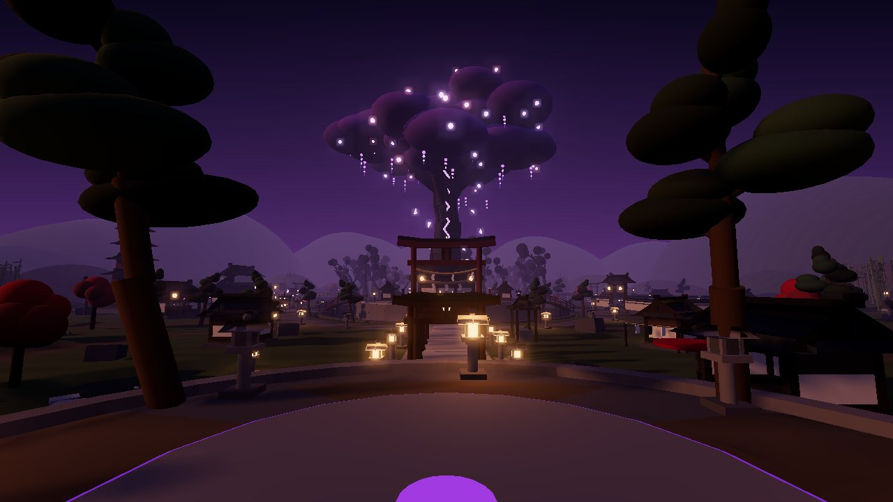
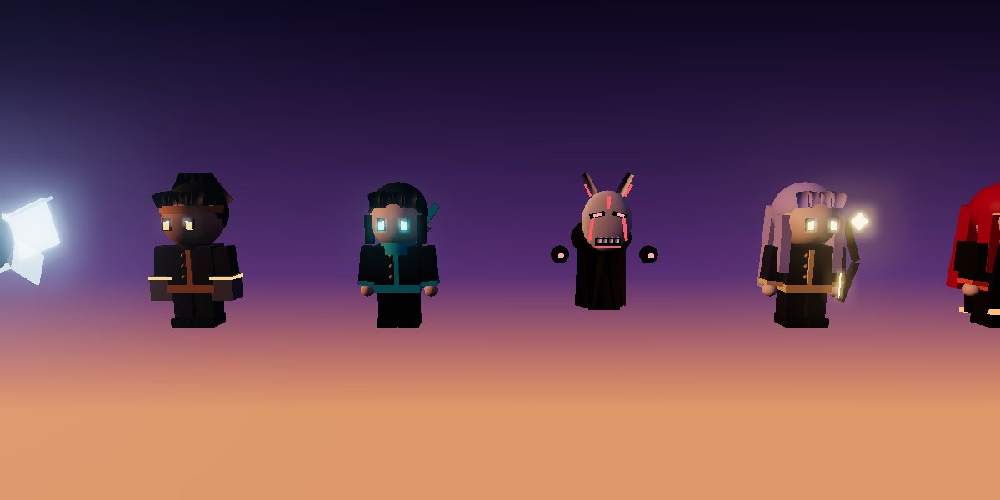
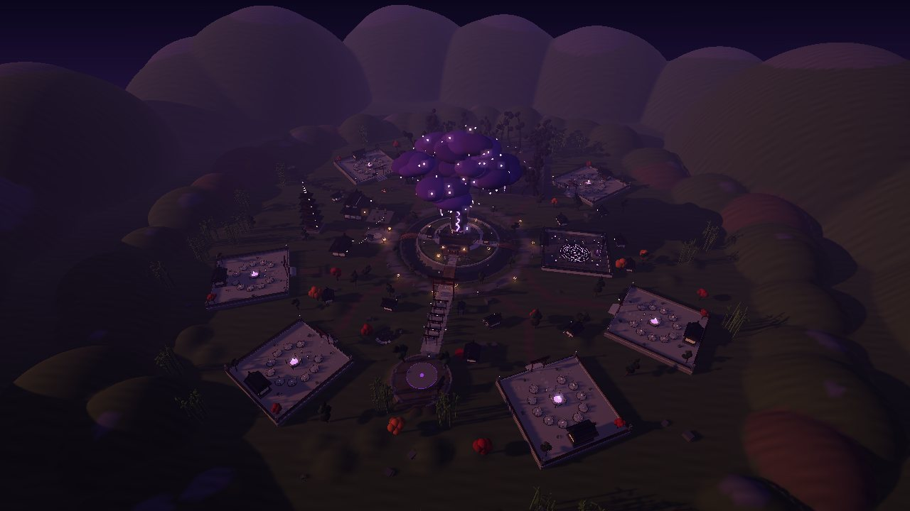
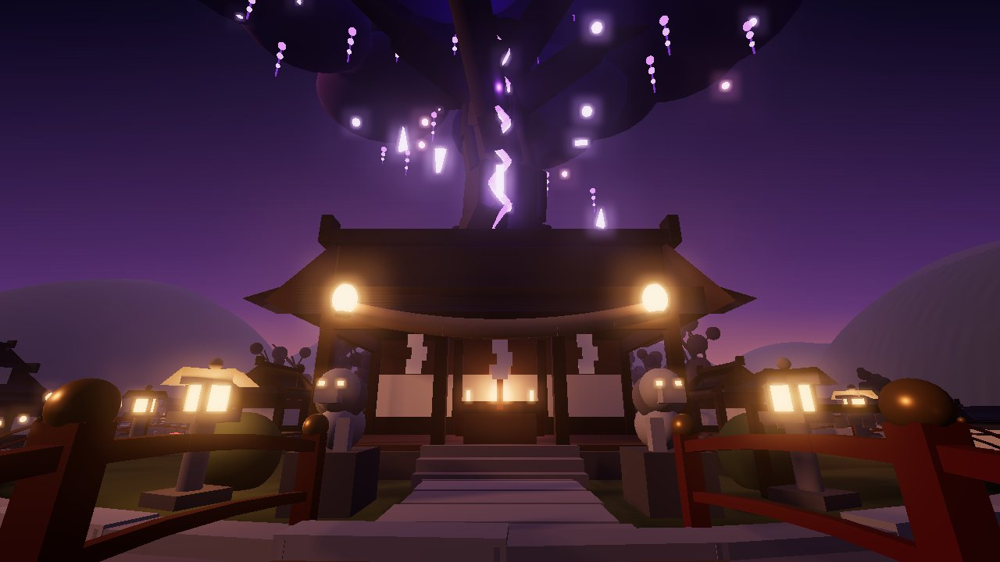
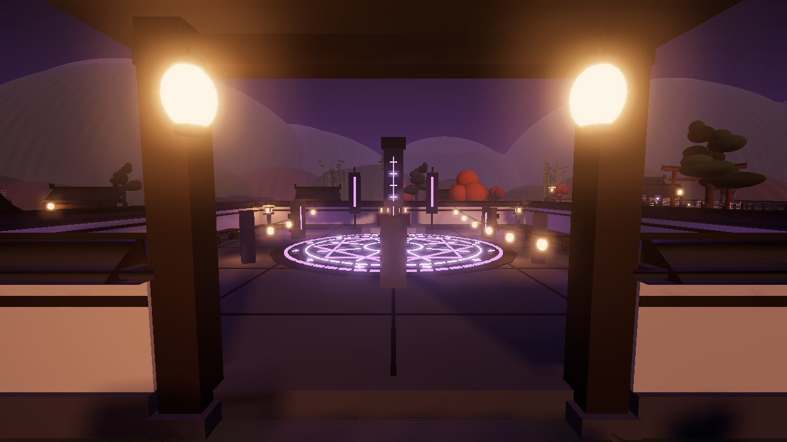
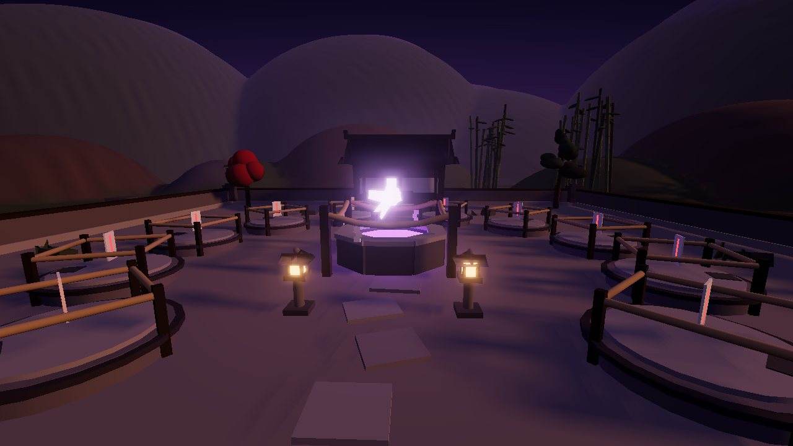
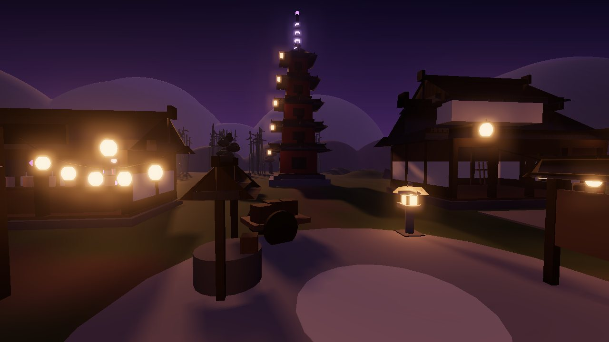

# Cursebound Farm

A Roblox anime farming game set in a moody Japanese supernatural village at dusk. Collect
original sorcerers and spirits, put them to work on training spots in your sanctuary, gather
the cursed energy they produce, and spend it on rituals, upgrades and new spots. Then cleanse
the Cursed Forest for extra energy and Curse Seals.

All characters, names, designs, abilities and branding are original. No anime assets,
Toolbox models or third-party code are used; every model is built from Roblox primitives by
the scripts in this repo.



> The images in this README are **offline previews** rendered from the baked map geometry
> with three.js (see *Verification*). They approximate Roblox's lighting; the real game will
> look different, usually brighter and with proper materials, in Studio.

---

## Quick start (play it in Studio)

1. Open **`dist/CurseboundFarm.rbxl`** in Roblox Studio (double-click it, or File > Open).
2. Press **Play**. On first start the server generates the terrain (about 1 second), then you
   arrive at the plaza facing the spirit tree, after a short flyover.
3. The tutorial card at the top walks you through: **collect, summon, place, upgrade, fight**.

To make progress save while testing in Studio, publish the place, then enable
**Game Settings > Security > Enable Studio Access to API Services**. Without it, the game runs
in a temporary in-memory mode and tells you so with a toast. It never writes fake data.

Before publishing for real players:

- **Server size: set Max Players to 6** (Creator Dashboard > your experience > Places >
  Server Size). There are six sanctuaries per server. A seventh player can still play but gets
  a toast saying no sanctuary is free.
- Optional: bake terrain into the place (see *Terrain* below) so servers skip generating it.
- Optional: add music and ambient audio IDs (see *Sound*).

## The game

| Loop step | Where | What happens |
|---|---|---|
| Collect | Your sanctuary's **Spirit Well** | Placed units fill the well every second. Walk into it, press **E**, or tap the HUD well card. Energy keeps accruing while you're offline, up to the well's capacity. |
| Summon | **Summoning Courtyard** (east) | Three rituals: Lantern (energy), Greater (energy, Rare or better), Sealed (Curse Seals, Epic or better). Pity guarantees a Legendary or better within 80 rituals. Your first-ever ritual is a guaranteed Rare. |
| Place | Your sanctuary | Ten training spots ring the well (two open at the start). Use the Allies panel or a spot's prompt; a ghost preview shows exactly where the unit goes. Moving a unit between spots swaps it with the occupant; placing a resting unit onto an occupied spot sends the occupant back to your roster. |
| Upgrade | **Talisman Shop** (west), or the HUD | Focus Training (+10% output), Deeper Well (+2 min capacity), Combat Mastery (+15% damage), Ritual Fortune (better odds), Expand Sanctuary (break the next spot's seal). Units also level up individually ("Train"). |
| Fight | **Cursed Forest** (north) | Three techniques (Strike, Spirit Lance, Violet Burst) against Gloomlings, Wailing Masks and the Hollow Brute. Rewards scale with your income; every player who did a meaningful share of the damage is rewarded. Practise on the Dojo dummies. |

**Units**: 14 originals across Common, Rare, Epic, Legendary and Mythic, including Tomo the
Lantern Wisp, Suzu Amane the Bell Warden, Kagerou the Hollow Mask, Ikazuchi the Thunder Cub,
Yoru Mikazuki the Veiled Sovereign and Kokuyo the Obsidian Maw. Each has an output rate, a
power stat (placed units' power boosts your combat damage), a max level and its own model.



**Pacing**: the first upgrade is affordable straight after placing your first summon (the
tutorial grants a small bonus). A simulation of an efficient player is in
`tools/lune/simulate.luau`: spot 3 after about 1 minute, spot 5 at about 6 minutes, spot 8 at
about 35 minutes, and a long tail beyond.

### Controls

| | Keyboard / mouse | Touch | Gamepad |
|---|---|---|---|
| Interact (collect, summon, shop, spots) | E | prompt button | X |
| Panels | F Summon, G Allies, U Upgrades, T Travel | HUD buttons | via HUD |
| Techniques (forest / dojo) | Click or 1, then 2, 3 | on-screen buttons (auto-aim at the nearest curse) | X / Y / R2 |
| Placement | hover and click a glowing spot | tap a spot, then **Confirm** | RB cycles spots, A confirms |
| Close panel | Esc | tap outside | B |

## The map

The village is compact and laid out radially so the core loop stays short. Everything is
within about a 15-second walk, and the **Travel** panel jumps between landmarks.



- **Shrine island (centre):** the giant fractured spirit tree with glowing seams, orbiting
  crystal shards, wisteria-like tassels and falling petals, plus a shrine hall, lion-dog
  guardians, sub-shrines, an ema rack, and a moat crossed by four arched bridges.
- **Arrival plaza (south):** a raised stone plaza. The view runs down a lantern-lined approach
  through a tunnel of torii and the Great Torii to the tree. It includes a purification
  pavilion, a teahouse and a koi pond.
- **Summoning Courtyard (east):** a walled court with an inlaid ritual circle whose rings
  rotate (and flare in the rarity colour when anyone summons), a rune stele, banners and
  violet braziers.
- **West district:** the Training Dojo with a practice yard and dummies, the Talisman Shop with
  a tanuki shopkeeper, a five-storey pagoda on the skyline, a well and a merchant's cart.
- **Cursed Forest (north):** entered through a giant broken torii. Twisted trees, ruined
  shrines, spider lilies, glowing mushrooms, violet mist and wisps, walled in for focused
  fights.
- **Six sanctuaries** around the village, each with a torii gate and owner sign, a Spirit Well
  with a floating crystal, sealed training spots, a shrine house, lanterns and a small garden.
- **Village life:** a ring road with lanterns and signposts, winding paths to every
  sanctuary, houses (laundry, barrels, benches), bamboo groves, pines and maples, a stream fed
  by a waterfall spring, an old graveyard by the forest, fireflies, hills and distant
  mountains.

| | |
|---|---|
|  |  |
|  |  |

The palette is held to dark wood, weathered stone, warm lantern light and violet cursed
energy (`src/server/Map/Palette.luau`). Lighting is a low dusk sun with violet haze, bloom so
neon reads as glowing, and a colour grade. There are about 10.7k anchored parts and 89 point
lights, with no unanchored scenery except the welded animated assemblies.

## Project layout

```
default.project.json        Rojo project (code + place settings: Future lighting, no streaming)
dist/CurseboundFarm.rbxl    Ready-to-open place: code + baked map + lighting
src/shared/                 ReplicatedStorage.Shared
  Config/                   Characters, Rarities, Banners, Upgrades, Enemies, Abilities,
                            MapLayout (single source of truth for positions), SoundConfig
  Rules/                    Pure game logic: Economy, Actions, ProfileSchema, Tutorial, CombatMath
  Util/                     Format, Prng, RateLimiter, Signal, TableUtil
  Visuals/                  PartKit, CharacterModels (14 units), CurseModels (3 curses)
  Net.luau                  Remote definitions
src/server/                 ServerScriptService.Server
  Main.server.luau          Boots the world, wires and starts services
  Services/                 DataService (+Data/ProfileStore, MockDataStore), StateService,
                            PlotService, GameService (all requests), TravelService, CombatService,
                            MapService
  Map/                      MapBuilder, Shrine, Courtyard, WestDistrict, Forest, Sanctuary,
                            Village, TerrainPlan, Atmosphere, Kit, Palette
src/client/                 StarterPlayerScripts.Client
  Main.client.luau          Creates controllers and panels
  Controllers/              State, Sound, UI (HUD), World (prompts, travel), Effects, Reveal,
                            Placement, Combat, Tutorial, Intro, Notification
  UI/                       Theme, UIKit, Panels/ (Summon, Units, Upgrades, Travel, Settings)
tests/                      Lune specs: rules, persistence, combat math + layout
tools/lune/                 Offline tooling: bake, tests, simulation, playtests, model export
tools/preview/              three.js preview renderer (development aid only)
scripts/build.sh            Full build + checks
```

### How it fits together

- **Server-authoritative.** Clients only send intents through one `Request` RemoteFunction
  and one `Ability` RemoteEvent. Every request is type-validated, rate-limited per player
  (token bucket), and applied by the pure rule functions in `Shared/Rules/Actions.luau`.
  Location-gated actions (collect, summon) check the character's position on the server.
  Combat hit detection, cooldowns, zone checks and damage all run on the server; clients play
  the VFX immediately for responsiveness.
- **State replication:** `StateService` pushes a throttled snapshot of the owner's profile.
  The client derives display numbers (rates, well fill) from the same shared `Economy` module,
  and extrapolates the well with the synchronised server clock.
- **Persistence:** `ProfileStore` is session-locked (`UpdateAsync`), retries with backoff, and
  takes over a lock only when it is stale or after its final retry. A server that has lost
  its lock can never write. A failed or corrupt load kicks the player with a friendly message
  and **never** writes defaults over real data. Profiles are sanitised and migrated on load;
  unknown units are preserved, not deleted. Saves happen on autosave (90s), on leave, and on
  shutdown (`BindToClose`).
- **Plots:** assigned on load and fully reset on leave (units, seals, sign, ward). Prompts for a
  sanctuary are created only on its owner's client.
- **World build:** structures are baked into the place file; `MapService` rebuilds them if
  they're missing (e.g. a fresh `rojo serve`), and generates terrain at startup.

## Building from source

Tools (pinned in `rokit.toml`): Rojo 7.5.1, Lune 0.10.4, StyLua 2.1.0, luau-lsp 1.53.1 and
Selene 0.29.0. Install with [rokit](https://github.com/rojo-rbx/rokit) (`rokit install`).

```bash
scripts/build.sh                                      # build + bake + all tests
LUAU_DEFS=path/to/globalTypes.d.luau scripts/build.sh # also run type analysis
PREVIEW=1 scripts/build.sh                            # also render previews (needs Node)
```

Live-syncing code while editing in Studio: open `dist/CurseboundFarm.rbxl`, run `rojo serve`,
and connect with the Rojo plugin. The map and lighting in the place are kept, because the project
doesn't own those Workspace and Lighting children. `rojo build default.project.json` alone
produces a code-only place; the server then generates the whole map at startup.

### Terrain

Terrain voxels can't be written offline, so the server generates them on startup (about 870
fill operations). To bake terrain into the place so you can see and edit it in Studio, run this
once in the **Command Bar** in edit mode, then save:

```lua
local MB = require(game.ServerScriptService.Server.Map.MapBuilder); MB.buildTerrain(workspace.Terrain); workspace.Terrain:SetAttribute("CurseboundTerrain", true)
```

### Tuning and content

- Balance lives in `src/shared/Config/*` (rates, costs, odds, pity, enemy stats, unlock costs).
  Re-run `lune run tools/lune/simulate.luau build/game.rbxl 120` to see the pacing.
- New characters: add an entry to `Characters.luau` (choose a `look.template`: Sorcerer,
  Lantern, Toad, Moth, Mask, Wolf or Serpent, and its colours and accessories). It appears in
  rituals, the Index and placement automatically.
- Map: positions come from `MapLayout.luau`; districts are separate modules under
  `src/server/Map/`.

### Sound

Every sound is defined in `src/shared/Config/SoundConfig.luau`. The defaults use audio that
ships with the Roblox client (`rbxasset://sounds/...`), so they always load without uploads
or permissions, but there are only a handful of them, so the effects are basic. To improve
the soundscape, put Creator Store audio IDs in the `id` fields. Music and the positional
ambient beds (water, forest, shrine, courtyard, village) are silent until you add IDs.

## Verification

I couldn't run Roblox Studio here, so everything was verified offline instead:

| Check | Result |
|---|---|
| `luau-lsp analyze` with Roblox type definitions over all of `src/` | 0 errors |
| Unit tests (rules, persistence safety, combat math, layout) | 43 / 43 pass |
| **Server playtest**: the real `Main.server.luau` running in a Lune engine shim against the baked place. Covers join, the whole tutorial, validation and rate limits, well accrual, curse spawning and kills, a second player, respawn at home, leave/save/release, rejoin with offline earnings, a failed-load kick without overwriting data, and shutdown saves. | 61 / 61 checks pass |
| **Client smoke test**: the real client scripts, driving every panel and button, placement, every effect type, notifications, all tutorial steps, combat and the recruitment reveal | 17 / 17 steps pass |
| Bake sanity checks (6 sanctuaries x 10 spots, wells, spawns, dummies, counter, altar, spawn point) | pass |
| Map composition | reviewed from the spawn camera, aerial, plan and player-height previews |

These checks caught and fixed real bugs before shipping, including a client crash (UI
buttons stored functions as Instance fields), a forest travel point outside the combat zone,
a spawn point rotated to face away from the tree, a mirrored `CFrame.lookAt` in the offline
bake runtime (patched in the tooling so baked orientations match Roblox), a placement
re-travel loop, and an overly long DataStore retry wait.

**Please still do a manual pass in Studio.** See `docs/PLAYTEST_CHECKLIST.md`. Physics,
rendering, input feel and performance on real devices can only be judged there.

## Known limitations

- **Not opened in Roblox Studio.** This environment has no Studio, so the game has not been run
  in the real engine; see *Verification* for what was checked instead.
- **No Toolbox, Blender or uploaded assets.** The Roblox domains were not reachable. Everything
  is built from primitives (parts, wedges, ellipsoids, neon), with built-in particle textures and
  sounds. There are no custom meshes, decals or images.
- **Audio is minimal** for the same reason (see *Sound*).
- **No custom character animations** (they require uploaded animation assets). Units bob
  procedurally; players use their default Roblox animations.
- Terrain is generated at server start unless you bake it in Studio.
